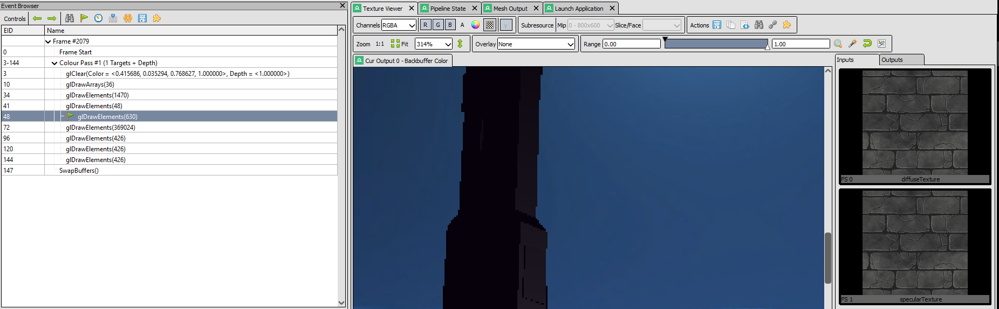
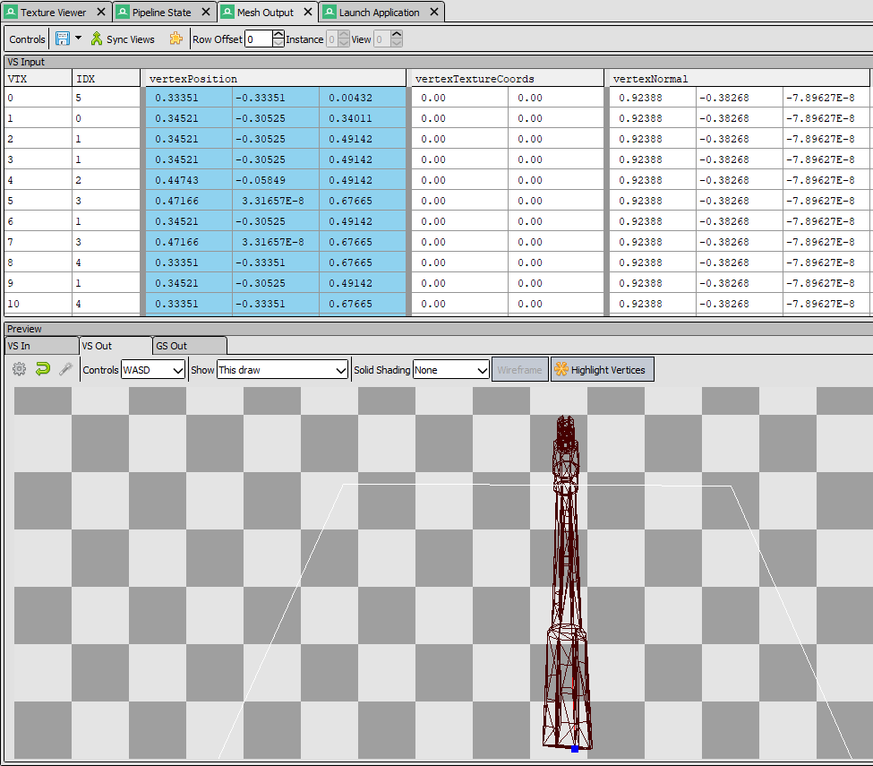

# comp220-worksheetA

## Implemented Effect Prototypes
I have implemented prototypes of two of my chosen effects: Lighting and Collision Detection.

### Lighting
Currently, a Blinn-Phong lighting model has been implemented with ambient, diffuse and specular lighting parameters. This lighting is also compatible with textures. The lighting shaders also take into account the properties of an object's material, such as its specular power and colour.

### Collision Detection
BulletPhysics has been integrated to the project to provide the physics for the game. So far, although collision detection is working fine, only primative collision shapes (spheres and boxes) have been implemented. Because of this, the main landscape model does not currently have a collision mesh, as primative shapes would not be suitable for such a complex mesh.

## Profiling
One issue with the current interation of the prototype is that the tower model is untextured. I attemtped to apply textures to the tower only for it to appear blank each time. After testing several diffent textures - none of which worked - I used RenderDoc to see if the texture was being loaded correctly.

I could see that the texture was loaded correctly, however it was still not visible on the model itself. I used the mesh output viewer to look for the texture coordinates of the model, as I had a growing suspicion that the free model I was using to prototype the game did not come with texture coordinates. 

It was clear from looking at the vertex data that the texture coordiantes were all 0, which explained why the textures were not displaying properly. Knowing this prevented me from wasting further time looking at the code and allowed me to continue building the prototype, as knew that the issue was with the model, not my program and could be easily fixed later.

## Plan
### Convex Hull Shape collision mesh
To create a suitably accurate collision shape for the complex landscape model, I will implement the btConvexHullShape which can create complex shapes from vertex data. This will require the vertex data of the model to be passed to it, so the Mesh class will have to be updated to store the vertex data.

### Lighting Improvements
One interesting problem regading lighting is that areas not facing the directional light are exceptionally grey, with material colours barely showing throught. Although areas not facing the light should be darker, they should retain more of their colour to prevent one side of the scene appearing flat. This may be due to the only light in the scene being a directinal light, or due to a miscalculation of the ambient light. I will be looking into improving this lighting issue by either adding additional lights or improving the lighting calculation and values.

### Improving textures and models
Currently, the tower model has no texture, as it lacks texture coordinates. The simplest solution would be to find a new model with texture coordinates which would allow me to simply replace the current model. However, a better long-term idea might be to build the entire scene in maya and apply textures there. This would then allow me to export all the 3d models as a single fbx file, and their textures as one texture file. This would reduce the amount of code duplication and tedious placement of objects via code.

### Shadows
IF there is time remaining after the above improvements have been made, I will be looking at implementing basic shadow effects using shadow mapping. I would ideally like to implement a shadow map for the scene, as well as improving shadow acne by adding an error margin.

## Resources
http://www.peroxide.dk/papers/collision/collision.pdf
https://learnopengl.com/Lighting/Basic-Lighting
https://dl-acm-org.ezproxy.falmouth.ac.uk/citation.cfm?id=311554
https://ebookcentral.proquest.com/lib/falmouth-ebooks/detail.action?docID=1674846
http://www.opengl-tutorial.org/intermediate-tutorials/tutorial-16-shadow-mapping/
https://learnopengl.com/Advanced-Lighting/Shadows/Shadow-Mapping

## Assets
http://haxor.thelaborat.org/resources/texture/skybox/
https://www.reddit.com/r/gamedev/comments/6nxwtq/free_lowpoly_medieval_assets/
https://www.cgtrader.com/free-3d-models/plant/leaf/free-low-poly-pack

